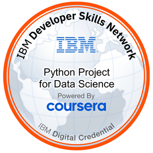
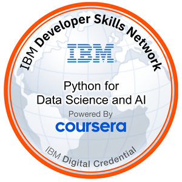
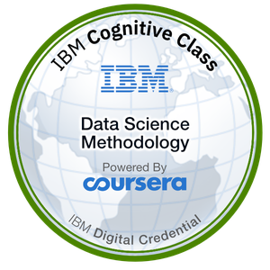
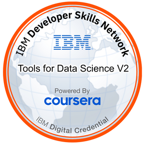
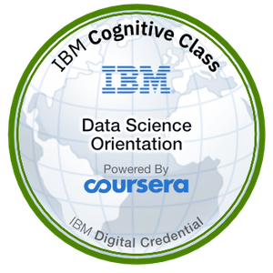

# Mohamed Soubhi — Interactive Career Timeline & Portfolio

> **Tech Lead & Embedded Architect** with 13+ years of experience in automotive software engineering (AUTOSAR BSW/RTE/ASW, ASIL B / ISO 26262, ASPICE Level 4), dual-OS embedded bootloaders (ESP-IDF FreeRTOS + Zephyr RTOS), and Graph Data Science / MLOps (Neo4j, DVC, Python).

---

## 🎖️ Verified Digital Badges (Credly)

All digital badges below are officially verified by issuing organizations on **[Credly](https://www.credly.com/users/mohamed-soubhi/badges)**:

| Badge | Credential | Issuer | Issue Date | Verification |
| :---: | :--- | :--- | :---: | :---: |
|  | **Python Project for Data Science** Applied data analysis, web scraping, financial data extraction (yfinance, Pandas) | IBM / Coursera | Sep 2026 | [Verify Badge ↗](https://www.credly.com/badges/d884ea44-85a7-41eb-8585-dd6595c8d633) |
|  | **Python for Data Science and AI** Python fundamentals, Pandas, NumPy, data structures, and APIs | IBM / Coursera | Sep 2026 | [Verify Badge ↗](https://www.credly.com/badges/3566b99c-507f-4747-a327-e165829bc7ee) |
|  | **Data Science Methodology** End-to-end data science lifecycle from business understanding to model deployment | IBM / Coursera | Sep 2026 | [Verify Badge ↗](https://www.credly.com/badges/7ec08c56-d7e7-422b-81bb-ee54ccf5edd8) |
|  | **Tools for Data Science V2** Jupyter Notebooks, RStudio, Git/GitHub, IBM Watson Studio | IBM / Coursera | Sep 2026 | [Verify Badge ↗](https://www.credly.com/badges/e307f764-180e-425e-8a90-8849e2f99f1c) |
|  | **Data Science Orientation** Foundational principles of data science, machine learning, and AI applications | IBM / Coursera | Sep 2026 | [Verify Badge ↗](https://www.credly.com/badges/0c94f44a-5117-4591-aa3e-329bfad70ef3) |
|  | **McKinsey.org Forward Program** Structured problem solving, effective communication, adaptability & resilience, digital toolkit | McKinsey.org | Apr 2024 | [Verify Badge ↗](https://www.credly.com/badges/d2701dcd-a1ad-43dc-8de7-bb4205520f8c) |

👉 **[View Full Verified Profile on Credly](https://www.credly.com/users/mohamed-soubhi/badges)**

---

## 🚀 Featured Engineering & Open-Source Projects

1. **[bootlab-esp — Dual-OS Bootloader & Resilient OTA Testbed](https://mohamed-soubhi.github.io/bootlab-esp/)**
   - Production-grade dual-OS (`ESP-IDF FreeRTOS` + `Zephyr RTOS & MCUboot`) bootloader testbed on dual ESP32-S3 silicon.
   - 400 parallel hardware soak cycles, zero eFuse risk, dual-transport OTA (WiFi HTTPS + NimBLE GATT), deterministic LABID framing, and automated Python HIL orchestration.
   - Includes interactive lab slide deck and `labflash` CLI.

2. **[The Intelligence Leap: Edge AI & TinyML](https://mohamed-soubhi.github.io/)**
   - 32-slide technical presentation and interactive telemetry lab on deploying real-time deep learning inference, INT8 quantization, and sensor fusion directly on microcontrollers.

3. **[Embedded Modern C++ Study Portal](https://mohamed-soubhi.github.io/)**
   - Architectural curriculum covering 116 projects from bare-metal to modern STL, deterministic memory management, ARM Cortex-M realities, and zero-overhead C++ idioms.

4. **[Competitive Powertrain Benchmarking](https://mohamed-soubhi.github.io/)**
   - EU heavy-duty vehicle (truck/bus) powertrain benchmarking and CO2 simulation platform.
   - DuckDB + Parquet analytical store (756k rows), live EEA data mining pipelines, and HistGradientBoosting ML regression models.

5. **[fraud-graph-demo](https://mohamed-soubhi.github.io/)**
   - End-to-end Graph Data Science application utilizing Neo4j, Cypher queries, and graph topology algorithms to detect multi-hop complex relationship anomalies.

6. **[used-car-dashboard-demo](https://mohamed-soubhi.github.io/)**
   - Interactive machine learning & analytics dashboard for automotive market valuation, pricing predictions, and exploratory data visualization.

7. **[Spanish A1 Exam Prep & Study Helper](https://mohamed-soubhi.github.io/Spanish-A1-Exam-Prep/)**
   - Exam prep portal aligned with CEFR & Instituto Cervantes DELE/SIELE standards with self-grading mock exams, official OMR answer sheets, and grammar decision matrices.

---

## 🛠️ Core Competencies & Technologies

- **Embedded Systems & Automotive**: AUTOSAR (BSW / RTE / ASW), AURIX TC3xx, ARM Cortex-M7, ESP32-S3, STM32F4, ESP-IDF FreeRTOS, Zephyr RTOS & MCUboot, UDS (ISO 14229), CDD, MISRA-C, Buildroot, Yocto.
- **Safety & Quality**: ASIL B (ISO 26262), ASPICE Level 4, AURIX Safety Library, SMU, SafeWDGM, SafeDGM, Safetymech, FMEA, V-Model, TDD.
- **AI & Graph Intelligence**: Neo4j Graph Data Science, PyTorch Geometric (GNN), TensorFlow Lite Micro (INT8), LangGraph AI Agents, DVC (Data Version Control), Python (Pandas, NumPy, Scikit-learn).
- **Diagnostics & Hardware Tools**: Lauterbach Trace32, Gliwa T1 Profiler, VectorCAST, CAPL, Davinci Configurator, CANalyzer / CANdb++, Polyspace, QAC.
- **Languages & DevOps**: C / Modern C++ (C++17/20), Python, Bash, Docker, Git/Bitbucket, Linux.

---

## 📬 Contact & Connect

- **Location**: Madrid, Spain
- **Email**: [eng.mohamed.soubhi@gmail.com](mailto:eng.mohamed.soubhi@gmail.com)
- **LinkedIn**: [linkedin.com/in/mohamed-soubhi](https://linkedin.com/in/mohamed-soubhi)
- **GitHub**: [github.com/mohamed-soubhi](https://github.com/mohamed-soubhi)
- **Credly**: [credly.com/users/mohamed-soubhi](https://www.credly.com/users/mohamed-soubhi/badges)
- **Kaggle**: [kaggle.com/mohamedsoubhi](https://www.kaggle.com/mohamedsoubhi)
- **Portfolio**: [https://mohamed-soubhi.github.io](https://mohamed-soubhi.github.io)
